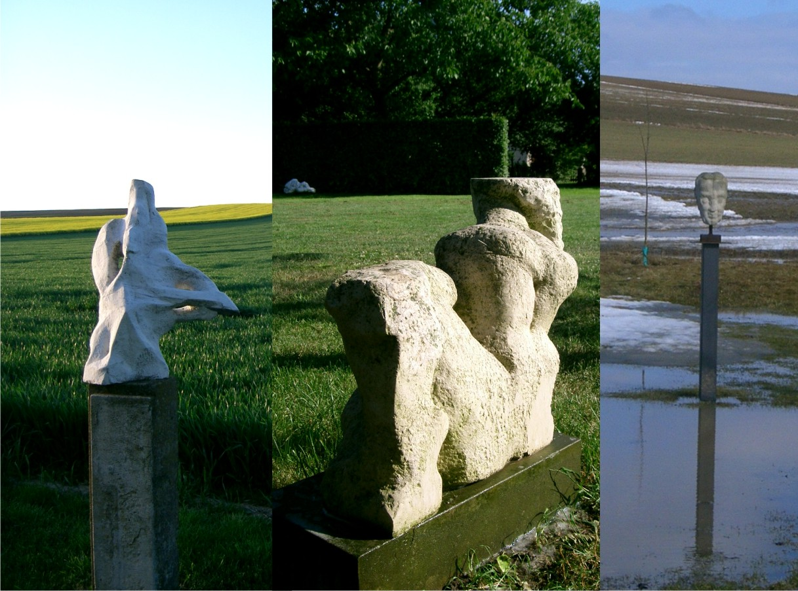

<h1>Skulpturengarten</h1>

In dem großzügig angelegten Garten des Architektenehepaars Backhaus-Barnett befinden sich seit etwa zwei Jahren insgesamt 15 Skulpturen der Dresdner Bildhauerin Charlotte Sommer­ Landgraf, die ihre Arbeiten für dieses ambitionierte private Projekt gerne als Dauerleihgabe zur Verfügung stellte. Auch die präzise Aufstellung der einzelnen Skulpturen im Dialog mit der Natur und der offen gestalteten Gartenanlage verdankt sich der engen Zusammenarbeit mit der Künstlerin. So entstand abseits vom klassizistischen Gartenreich Weimars ein ungewöhnliches und modernes Gesamtensemble von überzeugender Wirkung.

Tatsächlich definieren sich die abstrakt-expressiven Marmorskulpturen von Charlotte Sommer-Landgraf durch ihre Verbindung mit dem umgebenden Raum, den die Künstlerin als festen Bestandteil ihrer Skulpturen begreift. Die durch Prellen des Steins entstandenen natürlichen Bruchverläufe macht sie zum Ausgangspunkt ihres Formprozesses. Mit dieser bildhauerischen Position fand die 1928 in Dresden geborene Künstlerin jenseits der traditionellen, realistischen Figurenkunst eine eigene Verbindung zur internationalen Moderne.

Das Projekt der beiden Landschaftsarchitekten Backhaus-Barnett bietet eine interessante Alternative zur üblichen Aufstellung von Skulpturen im musealen oder städtischen Raum. Die Anlage besticht durch die pointierte und spannungsvolle Setzung der verschiedenen Skulpturen innerhalb des Gartens, der in seinen unterschiedlich gestalteten Bereichen historische Vorbilder wie einen barocken Bauerngarten oder einen offenen Landschaftsgarten zitiert. Dem Besucher des Garten bieten sich die unterschiedlichsten Blickachsen und Korrespondenzen, die nur in der Bewegung erschlossen werden. Ein Rundgang kann die Phantasie und Wahrnehmungsfähigkeit der Besucher anregen, aber auch der Besinnung und Meditation dienen. Dabei lädt der Garten zu wiederholten Besuchen ein, da es besonders reizvoll ist, ihn im Wechsel der Tages- und Jahreszeiten zu erleben. Eindrucksvoll ist die wechselnde natürliche Beleuchtung, die dramatische Effekte hervorrufen kann.

Der Skulpturengarten ist Teil eines ambitionierten privaten Projekts, das auch die gattungsübergreifende Präsentation anderer Künste, wie etwa Konzerte, szenische Lesungen, Theaterstücke u.a., beinhaltet. Der Garten bietet hier vielfältige Anknüpfungspunkte, sowohl in thematischer Hinsicht als auch als faszinierende Spielstätte. Das Anliegen des Architektenehepaars ist es, Kunst als einen wesentlichen Teil unserer Kultur auch abseits der großen Kulturzentren stattfinden zu lassen, um ein anderes Publikum zu erreichen und das hiesige Leben zu bereichern. Ähnlich wie etwa das Schleswig-Holstein Festival, das in den achtziger Jahren nach englischem Vorbild mit großem Erfolg aufs Land ging, um etwa in Scheunen und Ställen unverbrauchte, spannende Orte der Begegnung zu finden. Dabei haben sich die beiden Landschaftsarchitekten auch bereits an einigen überregionalen Initiativen beteiligt, wie dem "Tag des offenen Gartens 2003", oder eigene erfolgreiche Veranstaltungen organisiert, wie den 3. Weihnachtsmarkt im "Schafstall". Kunst auf dem Lande also, die auch über Rastenberg hinaus ausstrahlt und Besucher anzieht. Grundlage hierfür ist die Bildung eines Netzwerkes von interessierten und engagierten Personen, die bereit sind, mit hohem persönlichen Einsatz an der Entwicklung einer Gegend mitzuarbeiten.

Dr. Gerda Wendermann   Oberkustodin an der Stiftung Weimarer Klassik und Kunstsammlungen 12. Januar 2004

